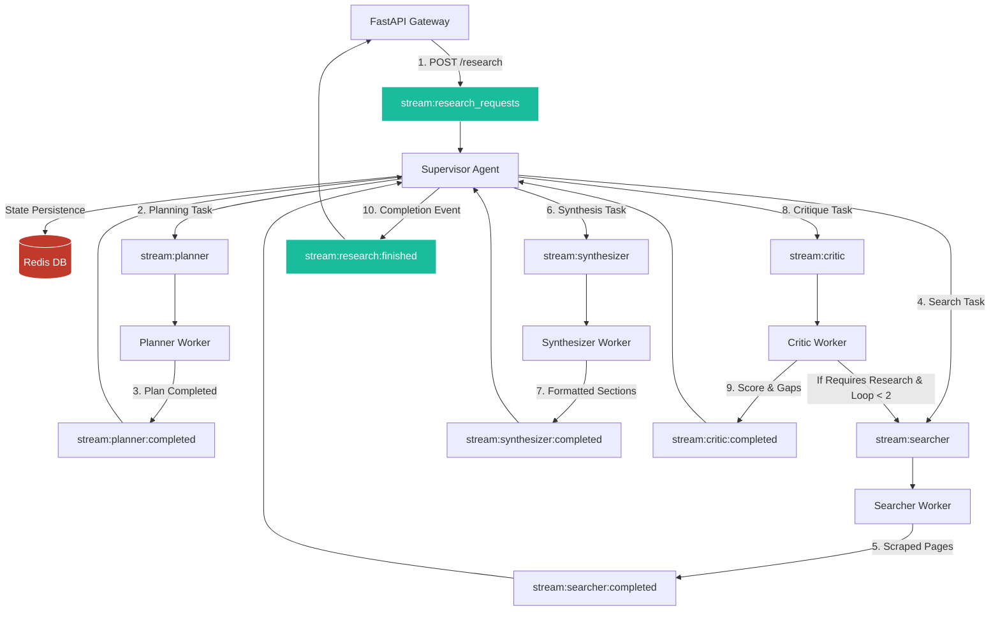

# Multi-Agent Web Research & Summarization System

## Problem Statement
Conducting thorough research on complex topics typically requires a human to work through several iterative steps: draft a search strategy, execute queries, read and filter articles, synthesize findings, and verify that nothing important was missed. Traditional linear automation pipelines break down at this task for four key reasons:
- **Lack of planning and strategy**: Simple linear pipelines execute keyword lookups directly, without first drafting a holistic search strategy. This leads to scattered, disjointed information retrieval rather than a coherent research trajectory.
- **Lack of depth and iteration**: Standard linear systems run a single search pass and immediately produce a summary. They have no mechanism to recognize gaps in the retrieved information or to trigger follow-up searches that fill those gaps.
- **Hallucinations and unverifiable claims**: Automated summaries often lack strict, traceable citation mappings, making it difficult — or impossible — to trace a given claim back to its primary source document.
- **Vulnerability to noise**: Raw document feeds are full of extraneous markup, boilerplate, and unrelated content. Left unfiltered, this noise clutters the context window and degrades the quality of synthesis.

To address these limitations, this agentic system is designed around **planning, iteration, and verifiable synthesis** rather than a single linear pass. It represents an enterprise-grade, production-ready Multi-Agent Web Research & Summarization System built with **Python 3.12+**, **FastAPI**, **Redis Streams**, and the **Groq SDK**.

---

## Key Features
- **Decoupled Asynchronous Message Bus**: Integrates Redis Streams to route messages across isolated processes via consumer groups, facilitating distributed execution. (Includes `InMemoryMessageBus` fallback for unit tests).
- **Process Isolation**: All agents run as independent background worker processes, communicating exclusively via the message bus, preventing process blocks.
- **Centralized Supervision & State Management**: A dedicated **Supervisor Agent** tracks research lifecycles in Redis hashes, executes stages, manages error-triggered retry pipelines, and enforces a global 5-minute timeout.
- **Official Groq SDK (`groq`)**: Connects to high-throughput Llama models (e.g. `llama-3.3-70b-versatile`) to generate text and structured JSON with client-level exponential backoff retries for rate limits (429s).
- **Embedded BM25 Search Engine**: Pure Python, high-performance BM25 ranker that indexes and ranks a local pre-crawled dataset of 10,000 documents. No external search engine dependencies are needed.
- **Robust Scraper & Normalizer**: Cleans HTML elements, strips script/style wrappers, normalizes spacing, and stamps scrape dates.
- **Multi-Format Export support**: Generates high-quality research reports in Markdown, JSON, and professional typeset PDF formats using ReportLab.
- **Comprehensive Logging & Telemetry**: Logs logs to standard output at `INFO` and `DEBUG` levels, generating detailed agent interaction traces.

---

## Technology Stack

### Backend Stack
- **Python 3.12+** — modern async features and speed.
- **FastAPI** — high-performance, asynchronous web framework serving the API layer.
- **Redis** — message bus broker (using Redis Streams) and state cache.
- **Groq SDK** — interacts with Llama models to generate text and structured JSON output.
- **Pydantic & Pydantic-Settings** — schema validation and environment configuration.
- **ReportLab** — programmatically compiles typeset, multi-page PDF documents.
- **aiofiles** — non-blocking, asynchronous file streaming for static asset downloads.
- **pytest & pytest-asyncio** — async testing framework.

### Frontend Stack
- **React 19 & TypeScript** — type-safe, component-driven dashboard UI.
- **Vite** — fast build tool and dev server with hot module reload.
- **Tailwind CSS v4** — utility-first CSS for styles, layouts, and custom themes.
- **Lucide React** — vector icon set for dashboards and action buttons.

---

## System Architecture

The application implements a decoupled frontend-backend architecture. Data flows asynchronously through the system's message bus.



---

## Working of the Multi-Agent Nodes

Reasoning labor is divided into specialized worker processes implementing abstract interfaces:

### A. The Planner Agent
- **File Location**: [planner.py](file:///c:/Users/VeerapunagalingamBha/Desktop/Agent/app/agents/planner.py)
- **Role**: Analyzes the initial topic and target depth to compile a multi-step search strategy. It outputs a structured list of 3-8 search queries tailored to target the index.
- **Output Schema**: Validated via Pydantic (`PlannerOutput`), specifying the strategy and queries.

### B. The Searcher Agent
- **File Location**: [searcher.py](file:///c:/Users/VeerapunagalingamBha/Desktop/Agent/app/agents/searcher.py)
- **Role**: Coordinates retrieval. It executes queries generated by the Planner against the BM25 index, extracts documents, runs HTML-cleaning and spacing normalization, and updates the shared state.

### C. The Synthesizer Agent
- **File Location**: [synthesizer.py](file:///c:/Users/VeerapunagalingamBha/Desktop/Agent/app/agents/synthesizer.py)
- **Role**: Collects all retrieved, normalized document contents, prompts the LLM via GroqClient, and compiles a comprehensive research report.
- **Output Schema**: Validated via Pydantic (`SynthesizedReport`), structured into an executive summary and multiple sections containing specific text and source citations.

### D. The Critic Agent
- **File Location**: [critic.py](file:///c:/Users/VeerapunagalingamBha/Desktop/Agent/app/agents/critic.py)
- **Role**: Acts as the gatekeeper. It evaluates the compiled report against the original prompt, scoring it for confidence, bias, and coverage. If significant gaps are found, it lists target queries and triggers a loop back to the Searcher.
- **Output Schema**: Validated via Pydantic (`CriticOutput`), indicating `requires_research` (boolean), `confidence_score` (float), `gaps` (list), and `bias_flags` (list).

### E. The Supervisor Agent
- **File Location**: [supervisor.py](file:///c:/Users/VeerapunagalingamBha/Desktop/Agent/app/agents/supervisor.py)
- **Role**: Acts as the system coordinator. It consumes new research requests, updates the Redis state key (`research:state:{report_id}`), drives the transition routing, catches agent worker errors to perform retries (limit 2), and runs a timeout monitor to fail runs exceeding 5 minutes.

---

## Detailed Execution Lifecycle

1. **API Submission**: A client posts a request to `/research`. FastAPI generates a unique `report_id`, publishes the payload to `stream:research_requests`, and polls the state key.
2. **Supervisor Init**: The Supervisor consumes the request, instantiates state hash tables in Redis, and publishes the planner task to `stream:planner`.
3. **Planner Phase**: The Planner worker consumes the task, executes the LLM call, and publishes queries to `stream:planner:completed`.
4. **Searcher Phase**: The Searcher worker consumes the queries, runs the BM25 ranker over 10,000 local documents, scrapes/normalizes HTML content, and publishes to `stream:searcher:completed`.
5. **Synthesizer Phase**: The Synthesizer worker receives documents, generates report sections and the summary, and publishes to `stream:synthesizer:completed`.
6. **Critic Phase**: The Critic worker reviews the report and sends feedback to `stream:critic:completed`.
7. **Routing & Critique Loop**: The Supervisor processes the critique:
   - If `requires_research=True` and loop count is less than 2, it publishes the missing gaps back to `stream:searcher` for a re-search loop.
   - Else, it compiles wall-clock durations and publishes the final state to `stream:research:finished`.
8. **Fault Tolerance**: If a worker encounters an error, it publishes to `stream:supervisor:errors`. The supervisor increments the retry counter and republishes the task up to 2 times.
9. **Timeout Monitor**: A background watcher checks active runtimes. If any task runs longer than 300 seconds, it aborts execution and publishes a timeout error.

---

## How to Run (Quickstart Guide)

Follow these steps to build and run the multi-agent system from scratch using Docker:

### 1. Clone the Code
```bash
git clone https://github.com/bharath-v-n-13/Multi-Agent-Web-Research-Summarization-Pipeline-.git
cd Multi-Agent-Web-Research-Summarization-Pipeline-
```

### 2. Configure the Groq Key
Create a `.env` file in the project root:
```env
GROQ_API_KEY=your_groq_api_key_here
```

### 3. Build & Run Containers
To build and launch Redis, the backend API, and all agent workers:
```bash
docker-compose up --build -d
```

### 4. Start the Frontend UI
In a separate terminal, start the UI:
```bash
cd frontend
npm install
npm run dev
```

### 5. Access the System
- **Frontend Dashboard**: Open [http://localhost:5173](http://localhost:5173)
- **Backend API Docs**: Open [http://localhost:8000/docs](http://localhost:8000/docs)


## How to Use the Research Dashboard UI

### Step 1: User Interface (UI)
The user inputs the research topic, target depth (shallow, moderate, or deep), maximum sources count, and desired output format (JSON, Markdown, or PDF) on the dashboard form.

### Step 2: Agent Orchestration and Execution
Once submitted, the system displays live process status updates, showing which agent worker process is currently executing (Planner, Searcher, Synthesizer, or Critic).

### Step 3: Research Dashboard
The dashboard displays agent execution metrics, research durations, active statistics, and links to download completed reports in Markdown, JSON, or typeset PDF files.

### Step 4: Research History
The Research History tab allows users to search, filter, and review previous research sessions and retrieve their generated documents.

---

## Verification & Testing

### Output Validation
Validate generated JSON reports against schema definitions, citation integrity, ID uniqueness, and confidence boundaries using:
```bash
./verify.sh
```

### Run Tests
To run the automated test suite locally:
```bash
PYTHONPATH=. pytest
```
Tests are fully mocked and run instantly offline.
