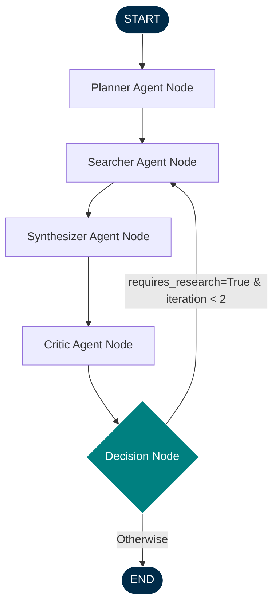

# Multi-Agent Web Research & Summarization System

An enterprise-grade, production-ready Multi-Agent Web Research & Summarization System built with **Python 3.12+**, **FastAPI**, **LangGraph**, and the official **Google Gemini SDK** (`google-genai`).

The system performs autonomous research on a user-provided topic by executing a structured multi-agent loop: planning research, matching documents from a local index of 10,000 pages using a BM25 ranker, scraping HTML text, synthesizing findings into unified sections with citation mapping, and running self-critiques to catch omissions and loop-back for further searching.

---

## Key Features

- **LangGraph Orchestrated Workflow**: Robust state machine that coordinates state values across Planner, Searcher, Synthesizer, and Critic agents with loops and conditional routing.
- **Official Google GenAI SDK (`google-genai`)**: Interacts asynchronously with Gemini models, leveraging Pydantic schemas for strict structured JSON output generation.
- **Embedded BM25 Search Engine**: Pure Python, high-performance BM25 ranker that indexes and ranks a local pre-crawled dataset of 10,000 documents. No external search engine dependencies are needed.
- **Robust Scraper & Normalizer**: Cleans HTML elements, strips script/style wrappers, normalizes spacing, and stamps scrape dates.
- **Multi-Format Export support**: Generates high-quality research reports in Markdown, JSON, and professional typeset PDF formats using ReportLab.
- **Comprehensive Logging & Telemetry**: Full execution metrics, agent runtimes, iteration loops, and loguru instrumentation.

---

## Architectural Layout

```
research_system/
├── app/
│   ├── api/
│   │      routes.py           # FastAPI routes & Orchestration
│   │      schemas.py          # Routing schemas
│   │
│   ├── agents/
│   │      planner.py          # Planner agent node
│   │      searcher.py         # Searcher/indexing agent node
│   │      synthesizer.py      # Synthesizer agent node
│   │      critic.py           # Critic & loop agent node
│   │
│   ├── graph/
│   │      state.py            # Shared graph state structure (TypedDict)
│   │      workflow.py         # LangGraph workflow definition & routing
│   │
│   ├── llm/
│   │      gemini_client.py    # Async Google GenAI SDK wrapper
│   │      prompts.py          # Prompts library
│   │
│   ├── search/
│   │      bm25.py             # Custom BM25 search index
│   │      scraper.py          # Page normalizer and html-stripper
│   │      ranking.py          # Merging, deduplication, and score ranking
│   │
│   ├── reports/
│   │      markdown.py         # Markdown compiler
│   │      pdf.py              # PDF compiler using ReportLab
│   │      json_report.py      # JSON serializer
│   │
│   ├── utils/
│   │      config.py           # Pydantic Settings management
│   │      logger.py           # Loguru telemetry configurations
│   │      timer.py            # Execution duration context managers
│   │
│   ├── models/
│   │      request.py          # API Request pydantic validation
│   │      response.py         # API Response pydantic validation
│   │
│   └── main.py                # Boot application & pre-loads index
│
├── data/
│      documents.json          # Pre-crawled document dataset (10,000 pages)
│      urls.json               # Full list of crawled URLs
│
├── scripts/
│      generate_dataset.py     # Script to generate synthetic dataset
│
├── tests/                     # Unit & Integration test suite
│
├── .env                       # Environment credentials configuration
├── requirements.txt           # Dependency requirements
└── README.md                  # System Documentation
```

---

## Agent State Flow Diagram



---

## Setup and Installation

### 1. Clone the Project Workspace
Ensure you are running in a Python 3.12+ environment.

### 2. Configure Environment Variables
Create a `.env` file in the project root:
```env
GEMINI_API_KEY=your_gemini_api_key_here
GEMINI_MODEL=gemini-2.5-flash
LOG_LEVEL=INFO
DATA_DIR=data/
```

### 3. Install Dependencies
```bash
pip install -r requirements.txt
```

### 4. Populate 10,000 Documents Dataset
Generate the local document dataset if it is not present:
```bash
python scripts/generate_dataset.py
```
This generates:
- `data/documents.json`: Contains 10,000 structured pages spanning Quantum Computing, AI, renewable energy, biology, and cybersecurity.
- `data/urls.json`: List of document URLs.

---

## Running the Application

Start the FastAPI application with Uvicorn:
```bash
uvicorn app.main:app --reload
```
On startup, the system parses the 10,000 documents and builds the BM25 index in memory (lifespan loader), making search queries instantaneous.

- **API Documentation**: http://127.0.0.1:8000/docs
- **Health Endpoint**: http://127.0.0.1:8000/health

---

## API Usage Example

### POST `/research`

#### Request Payload:
```json
{
  "topic": "Future of Quantum Computing",
  "depth": "deep",
  "max_sources": 10,
  "output_format": "pdf"
}
```

#### Curl Command:
```bash
curl -X 'POST' \
  'http://127.0.0.1:8000/research' \
  -H 'accept: application/json' \
  -H 'Content-Type: application/json' \
  -d '{
  "topic": "Future of Quantum Computing",
  "depth": "deep",
  "max_sources": 10,
  "output_format": "pdf"
}'
```

#### Validated Response Payload:
```json
{
  "report_id": "8c59f213-9f4a-431f-bc87-9da58c0c4be5",
  "topic": "Future of Quantum Computing",
  "summary": "Executive summary detailing key aspects of quantum roadmaps, hardware scale, and qubit decoherence control...",
  "sections": [
    {
      "heading": "Superconducting Qubits and Scaling",
      "content": "Detailed overview of superconductive circuits, hardware limitations, and thermal protection requirements in the NISQ era...",
      "citations": [
        "https://www.academic-research-portal.org/quantum_computing/future-of-quantum-computing.html"
      ]
    }
  ],
  "sources": [
    {
      "source_id": "S1",
      "url": "https://www.academic-research-portal.org/quantum_computing/future-of-quantum-computing.html",
      "title": "The Future of Quantum Computing: Opportunities and Roadmaps",
      "relevance_score": 12.84,
      "scraped_at": "2026-07-13T12:00:00Z"
    }
  ],
  "critique": {
    "confidence_score": 0.91,
    "gaps": [],
    "bias_flags": []
  },
  "metadata": {
    "total_urls_visited": 10,
    "agent_interactions": 4,
    "wall_clock_seconds": 8.6
  }
}
```

When a request executes, a formatted report is saved to disk:
- Markdown reports are exported to `reports/report_<id>.md`
- JSON reports are exported to `reports/report_<id>.json`
- Typeset PDFs are exported to `reports/report_<id>.pdf`

---

## Test Verification

Run the test suite to verify code correctness, BM25 scoring, HTML parsing, request models, and routing logic:
```bash
pytest -v
```
All tests mock Gemini API interactions, allowing testing of node connectivity and flow logic to run instantly and offline.
